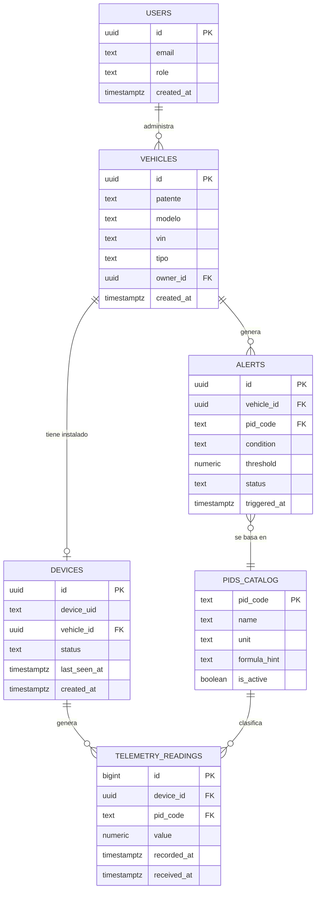

# 02 — Arquitectura y Módulos

**Proyecto:** Sistema de Telemetría Vehicular
**Autores:** Patricio Sussini Guanziroli, Matias Ezequiel Vazquez
**Tutor:** Sebastián Bruselario
**Entrega:** 2.ª Entrega — Diseño y Módulos (Condición de Regular)

---

## 1. Introducción

Este documento presenta el diseño de la base de datos y el listado de módulos que componen el backend del sistema de telemetría. Se toma como base el stack tecnológico definido en la 1ª Entrega: **Node.js (Express/NestJS)** sobre una **VM Always Free de Oracle Cloud**, con **Supabase (PostgreSQL)** como motor de base de datos único, ingesta de datos vía **MQTT (HiveMQ Cloud)** desde un **ESP32 + adaptador ELM327**, y frontend en **React**.

El objetivo del documento es dejar establecido el contrato de datos (esquema) y la división de responsabilidades (módulos) sobre los cuales se va a construir el desarrollo, de forma que pueda ser revisado y aprobado por el tutor antes de avanzar con la implementación.

---

## 2. Esquema de base de datos

### 2.1 Justificación del modelo relacional

Se eligió un modelo **relacional (PostgreSQL vía Supabase)** por sobre uno documental porque:

- Los datos tienen una **estructura bien definida y estable**: un vehículo, un dispositivo, una lectura de sensor. No hay variabilidad de esquema entre registros.
- Existen **relaciones claras entre entidades** (un vehículo tiene un dispositivo, un dispositivo genera muchas lecturas), lo que se beneficia de claves foráneas e integridad referencial.
- Supabase provee autenticación y gestión de usuarios integrada sobre PostgreSQL, evitando duplicar esa responsabilidad en otro motor.
- No hay un requisito de escalado horizontal masivo que justifique una base NoSQL en esta etapa del proyecto (escala esperada: flota interna, no miles de vehículos concurrentes).

### 2.2 Diagrama entidad-relación



### 2.3 Detalle de tablas

| Tabla | Propósito | Notas de diseño |
|---|---|---|
| `users` | Usuarios del sistema, gestionados por Supabase Auth. | El campo `role` distingue `admin` / `operador`. No se guarda password (lo maneja Supabase Auth). |
| `vehicles` | Catálogo de vehículos de la flota. | Se generaliza de "camiones" a `vehicles` para no acoplar el modelo a un único tipo de unidad; el campo `tipo` (ej. `camion`, `utilitario`) permite distinguir subtipos sin cambiar el esquema. `owner_id` referencia al usuario responsable (opcional según necesidad real del cliente). |
| `devices` | ESP32 físico instalado en cada vehículo. | Relación 1:1 con `vehicles` en el MVP (un dispositivo por vehículo). `status` indica online/offline. `last_seen_at` se actualiza con cada mensaje MQTT recibido. |
| `pids_catalog` | Catálogo de PIDs estándar SAE J1979 soportados (RPM, velocidad, temperatura de refrigerante, nivel de combustible, etc.). | Tabla de referencia, no de eventos. Se carga como seed/migration, no vía API. |
| `telemetry_readings` | Lecturas individuales de telemetría. | Tabla de mayor volumen de escritura — pensada como *append-only*. `recorded_at` es el timestamp que informa el dispositivo, `received_at` el que registra el servidor (permite detectar latencia o desconexiones). Candidata a particionamiento por fecha si el volumen crece. |
| `alerts` | Alertas generadas por umbrales sobre un PID. | Incluida en el esquema para no romper compatibilidad futura. |

### 2.4 Índices previstos

- `telemetry_readings(device_id, recorded_at)` — para consultas de series temporales por dispositivo.
- `telemetry_readings(pid_code, recorded_at)` — para consultas agregadas por tipo de dato.
- `devices(device_uid)` único — para resolver rápidamente qué vehículo corresponde a un mensaje MQTT entrante.
- `devices(vehicle_id)` único — refuerza la relación 1:1 dispositivo↔vehículo a nivel de base de datos.

---

## 3. Listado de módulos del backend

| # | Módulo | Responsabilidad | Depende de hardware |
|---|---|---|---|
| 1 | **Ingesta MQTT** | Suscribirse a los tópicos de HiveMQ Cloud, validar el payload entrante y delegar el guardado al módulo de almacenamiento. Debe ser resiliente a reconexiones (proceso persistente en la VM). | Parcial — contrato de mensaje simulado; en espera de confirmación. |
| 2 | **Almacenamiento (Storage)** | Interfaz abstracta de persistencia (patrón repository), con una implementación concreta sobre Supabase/PostgreSQL. Desacopla el resto del sistema del motor de base de datos específico. | No |
| 3 | **API REST** | Endpoints para que el frontend consuma datos: listado de vehículos, telemetría histórica y en tiempo real, estado de dispositivos. | No |
| 4 | **Autenticación y autorización** | Integración con Supabase Auth: login, manejo de sesión/token, control de acceso por rol. | No |
| 5 | **Gestión de dispositivos** | Alta, baja y vinculación de dispositivos ESP32 a vehículos; actualización de estado online/offline. | No |
| 6 | **Alertas** | Evaluación de condiciones simples sobre lecturas entrantes (ej. temperatura > umbral) y registro de alertas. | No |

### 3.1 Orden de desarrollo propuesto

1. Esquema de base de datos en Supabase (migrations).
2. Módulo de almacenamiento (interfaz + implementación Postgres).
3. Módulo de ingesta MQTT contra un **publicador simulado** (mensajes de prueba con el contrato propuesto).
4. Módulo de autenticación.
5. Módulo de API REST (lectura de datos ya almacenados).
6. Módulo de gestión de dispositivos.
7. Módulo de alertas (si el MVP lo contempla).

Este orden permite que el desarrollo backend avance de forma independiente a la validación de hardware que está realizando Patricio: los módulos 1 a 5 no requieren un ESP32 físico, solo el contrato de datos que se documenta a continuación.

### 3.2 Contrato de mensaje MQTT (propuesto, sujeto a confirmación con firmware)

```json
{
  "device_uid": "esp32-001",
  "recorded_at": "2026-09-08T14:32:10Z",
  "readings": [
    { "pid": "010C", "value": 2150 },
    { "pid": "010D", "value": 87 },
    { "pid": "0105", "value": 92 }
  ]
}
```

Este formato agrupa varias lecturas por mensaje (menor overhead de conexiones 4G) y usa los códigos de PID estándar de SAE J1979 como identificador. Queda marcado como *propuesto* hasta que se confirme cómo el firmware arma el payload real; si el formato final difiere, el ajuste queda acotado al parser del módulo de ingesta (punto 1), sin afectar al resto del sistema.
