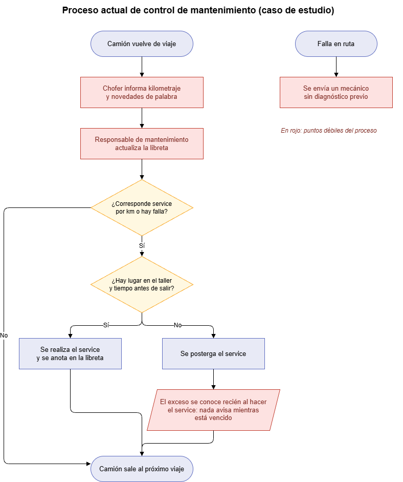
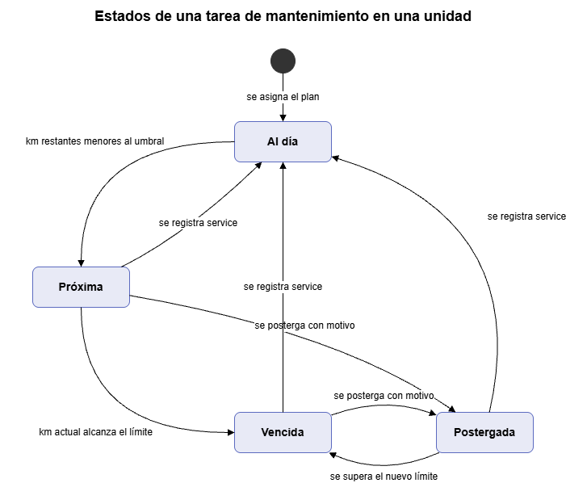
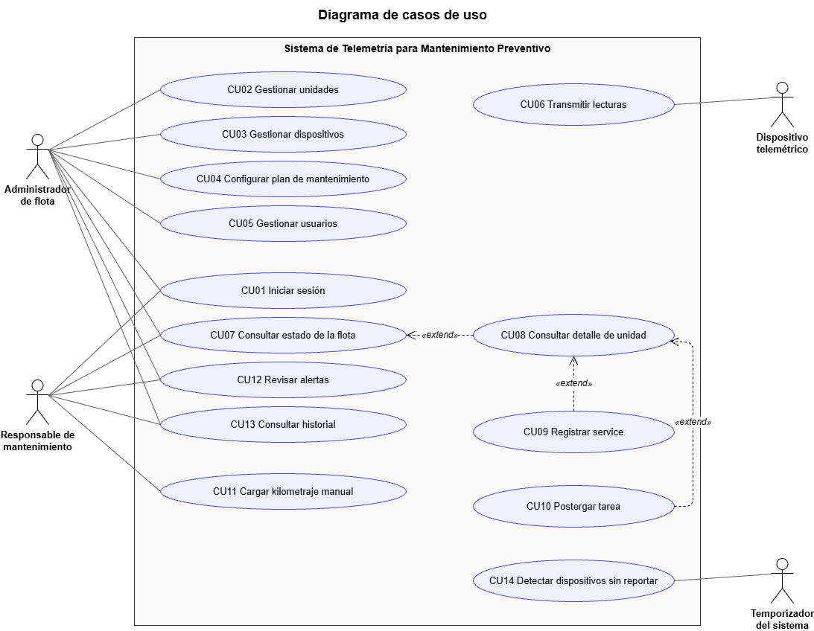
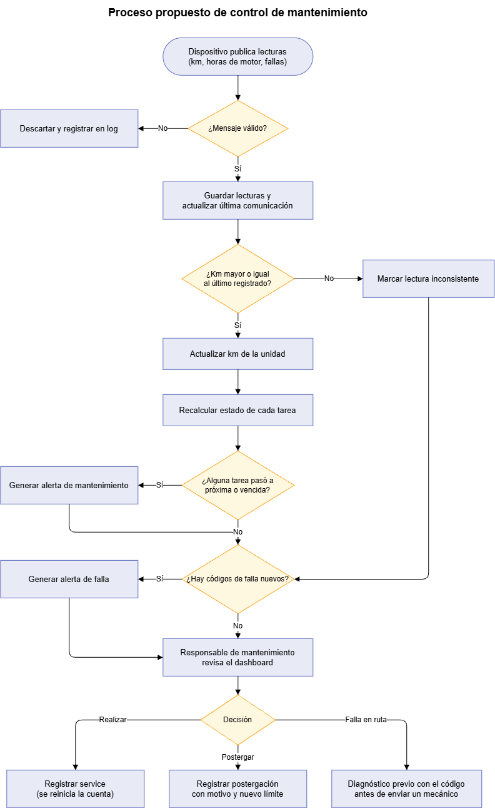
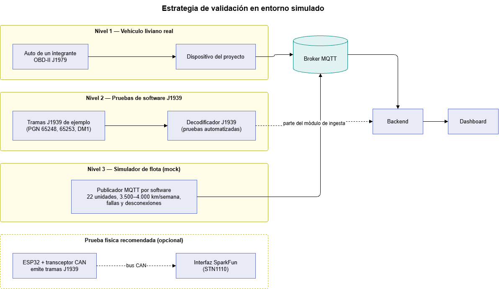
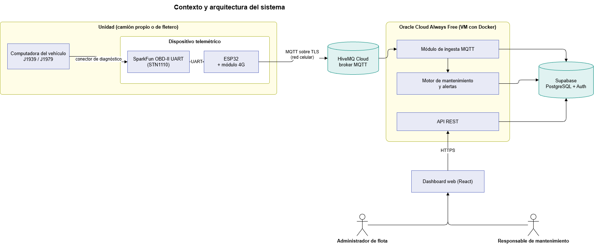

# Tecnicatura Universitaria en Programación a Distancia
### Trabajo Final Integrador
**1ª Entrega — Propuesta de Proyecto y Repositorio**

# Sistema de Telemetría Vehicular para el Mantenimiento Preventivo de Flotas Mixtas

**Integrantes:** Patricio Sussini Guanziroli (hardware y firmware, frontend), Matias Ezequiel Vazquez (backend, bases de datos e infraestructura)

**Tutor:** Sebastián Bruselario

---

## Índice

1. [Identificación de la problemática](#1-identificación-de-la-problemática)
   - [1.1 Caso de estudio](#11-caso-de-estudio)
   - [1.2 El problema](#12-el-problema)
   - [1.3 Quién lo padece](#13-quién-lo-padece)
   - [1.4 Evidencia de que el problema existe](#14-evidencia-de-que-el-problema-existe)
   - [1.5 Qué pasa si no se resuelve](#15-qué-pasa-si-no-se-resuelve)
   - [1.6 Por qué admite una solución tecnológica](#16-por-qué-admite-una-solución-tecnológica)
2. [Propuesta de valor y alternativas](#2-propuesta-de-valor-y-alternativas)
   - [2.1 Alternativas y por qué no alcanzan](#21-alternativas-y-por-qué-no-alcanzan)
   - [2.2 Propuesta](#22-propuesta)
3. [Actores](#3-actores)
4. [Alcance](#4-alcance)
   - [4.1 Alcance de la primera versión](#41-alcance-de-la-primera-versión)
   - [4.2 Fuera de alcance](#42-fuera-de-alcance)
5. [Requerimientos funcionales](#5-requerimientos-funcionales)
6. [Requerimientos no funcionales](#6-requerimientos-no-funcionales)
7. [Reglas de negocio](#7-reglas-de-negocio)
8. [Casos de uso](#8-casos-de-uso)
   - [8.1 Diagrama y listado](#81-diagrama-y-listado)
   - [8.2 Casos de uso principales](#82-casos-de-uso-principales)
9. [Plan de trabajo](#9-plan-de-trabajo)
   - [9.1 Objetivos](#91-objetivos)
   - [9.2 Estrategia de validación](#92-estrategia-de-validación)
   - [9.3 Hardware](#93-hardware)
   - [9.4 Stack de software](#94-stack-de-software)
   - [9.5 Riesgos](#95-riesgos)
10. [Trazabilidad entre problema y requerimientos](#10-trazabilidad-entre-problema-y-requerimientos)
11. [Glosario](#11-glosario)
12. [Anexo A. Ficha de la entrevista](#anexo-a-ficha-de-la-entrevista)

---

## 1. Identificación de la problemática

### 1.1 Caso de estudio

El problema se relevó en una **empresa de transporte refrigerado de Luján (provincia de Buenos Aires)** que traslada principalmente fruta, además de carne, en semirremolques con equipos de frío (en adelante, *la Empresa*). La información se obtuvo mediante una entrevista a un mecánico que trabajó en el taller de la Empresa, con datos vigentes hasta febrero de 2026 (ver [Anexo A](#anexo-a-ficha-de-la-entrevista)).

La Empresa se usa como **caso de estudio**: es la fuente de evidencia del problema y de las reglas de negocio, pero no es un cliente del proyecto ni brinda acceso a sus vehículos. La solución se diseña para **pymes de transporte con flotas mixtas** como la Empresa y se valida en un entorno simulado ([sección 9.2](#92-estrategia-de-validación)).

En este documento, **unidad** es cada camión (tractor) de la flota, sea propio de la Empresa o de un fletero.

**Composición de la flota:**

| Grupo | Unidades | Telemetría visible para la Empresa |
|---|---|---|
| Camiones propios de 2020 en adelante (Scania, Mercedes-Benz, Volvo) | 7 | Sí: plataforma de cada fabricante, contratada por la Empresa |
| Camiones propios anteriores a 2020 | 2 | No |
| Camiones de fleteros (choferes propietarios que trabajan con un semirremolque de la Empresa) | 13 | No |
| **Total** | **22** | **7 con datos (32%) · 15 sin datos (68%)** |

Cada camión recorre **entre 3.500 y 4.000 km por semana**, es decir, alrededor de 195.000 km por año. La Empresa realiza en su propio taller el mantenimiento de **todas** las unidades, tanto las propias como las de los fleteros.

### 1.2 El problema

> **La Empresa controla el mantenimiento preventivo de su flota con una libreta y con lo que informan los choferes, porque la telemetría de fábrica solo cubre a sus camiones propios más nuevos, cada marca en su propia plataforma. Para 15 de sus 22 camiones no tiene datos automáticos de kilometraje ni de fallas.**

Hoy el proceso funciona así:

1. El camión vuelve de viaje.
2. El chofer informa el kilometraje y cualquier novedad ("se prendió tal luz", "tengo un problema con tal parte").
3. El responsable de mantenimiento actualiza la libreta y decide si corresponde un service por kilometraje o una reparación.
4. Si el taller está ocupado o el camión tiene que salir rápido, el service se posterga hasta un próximo regreso. Cuántos kilómetros se excedió se sabe recién cuando se hace el service; mientras tanto, nada avisa que la unidad está vencida.

*En rojo, los puntos débiles del proceso.*

### 1.3 Quién lo padece

- **Responsable de mantenimiento del taller.** Carga con el control manual de unas 120 intervenciones por año que se programan por kilometraje, depende de la palabra del chofer para enterarse de fallas y concentra en su memoria y en su libreta todo el estado de la flota.
- **Dueño o administrador de la flota.** Ya valora tener datos: entraba seguido a la plataforma de Scania para revisar consumo, velocidad y tiempos detenidos. Pero solo tiene esa visión para 7 unidades, repartida en portales distintos según la marca. Sobre el resto de la flota, que transporta su mercadería con sus semirremolques, no tiene información hasta que el camión vuelve.
- **Fleteros y choferes.** Hoy son la única fuente de información sobre su unidad y deben reportar a mano. Un olvido o un dato impreciso de su parte afecta directamente la planificación del taller.

### 1.4 Evidencia de que el problema existe

**Evidencia primaria, obtenida en la entrevista** (detalle en el [Anexo A](#anexo-a-ficha-de-la-entrevista)):

- **El registro es manual.** "Llevaban en una libreta anotado el kilometraje por cambios de aceite, filtros, etc." La libreta se actualiza cuando los camiones vuelven de cada viaje.
- **Depende de una persona.** "Principalmente la llevaba una persona; cuando varias personas intentaron llevarla había desorganización."
- **Los services se postergan.** "Se ha dejado pasar o postergado services por necesidad de sacar el camión rápido, porque necesitaban espacio en el taller o porque el camión tenía que salir rápido para otro destino."
- **Las fallas lejos del taller se atienden a ciegas.** "Ha pasado en contadas ocasiones que por algún accidente haya salido un mecánico desde Buenos Aires hasta Santa Fe o donde se encuentre el camión para hacer algún arreglo. Pierde la Empresa."
- **La cobertura de fábrica es parcial.** Los camiones de 2020 en adelante vienen con monitoreo de fábrica que paga la Empresa; los anteriores y los de fleteros no tienen nada que la Empresa pueda consultar.
- **El dueño usa los datos cuando los tiene.** Consultaba con frecuencia la plataforma de Scania, que le muestra velocidad, estilo de manejo, consumo, tiempo detenido y temperatura del motor.

Volumen del control manual, calculado a partir de los datos relevados para las 15 unidades sin telemetría y con los intervalos que informó el mecánico:

| Tarea | Intervalo | Intervenciones por camión al año | Total (15 camiones) |
|---|---|---|---|
| Cambio de aceite de motor | 40.000 km (60.000 con aceite sintético) | ≈ 4,9 | ≈ 73 |
| Filtro secador de aire de frenos | 100.000 km | ≈ 2 | ≈ 29 |
| Aceite de caja y diferencial | 150.000–180.000 km | ≈ 1,2 | ≈ 18 |
| **Total** | | | **≈ 120 por año** |

*Cálculo: 3.750 km por semana × 52 semanas ≈ 195.000 km por año por camión, dividido por el intervalo de cada tarea.*

**Evidencia secundaria, del mercado argentino:**

- Las tres marcas de la flota ofrecen en Argentina plataformas propias de gestión de flota, con datos del vehículo y avisos de mantenimiento:
  - Scania: [Servicios Conectados / My Scania](https://www.scania.com/ar/es/home/services/data-driven-services.html).
  - Mercedes-Benz: Fleetboard.
  - Volvo: [Volvo Connect](https://www.volvotrucks.com.ar/es-ar/news/press-releases/2023/nov/simplificando-la-gestion-de-flotas-con-volvo-connect.html), con alertas de lámparas de advertencia, nivel de aceite y temperaturas.

  Que los fabricantes inviertan en estas plataformas confirma que el dato del vehículo tiene valor para el transportista. Al mismo tiempo, cada una se basa en el equipo telemático que el fabricante instala de fábrica en sus unidades recientes: los camiones más antiguos, o los de terceros sobre los que la Empresa no contrata el servicio, quedan afuera.

### 1.5 Qué pasa si no se resuelve

- **El control sigue dependiendo de una persona.** Si el responsable de la libreta no está, la información se desordena, como ya ocurrió cuando varias personas intentaron llevarla.
- **Los vencimientos se detectan tarde.** El exceso de un service postergado se conoce cuando finalmente se hace. Mientras tanto nada avisa que la unidad está vencida, y para saber cuántas unidades están en esa situación hay que revisar la libreta.
- **Las fallas en ruta se siguen diagnosticando a distancia sin datos.** Se envía un mecánico a cientos de kilómetros sin saber qué código de falla tiene el camión. Ese costo lo absorbe la Empresa.
- **El método no escala.** Cada camión que se suma, propio o de un fletero, agrega carga manual al taller, mientras la telemetría de fábrica solo crece si se compran camiones nuevos de una sola marca.

### 1.6 Por qué admite una solución tecnológica

Los datos necesarios **ya existen dentro del vehículo**. La computadora del camión conoce el kilometraje total, las horas de motor y los **códigos de falla** (códigos que registra ante un desperfecto), y los publica en su red interna mediante protocolos estándar: **SAE J1939** en vehículos pesados y **SAE J1979 (OBD-II)** en livianos. Las marcas europeas de camiones acordaron además una interfaz estándar para que sistemas de terceros lean esos datos, el **FMS-Standard**.

El problema no es la falta de datos, sino que **no se capturan de forma independiente de la marca y del dueño del camión**. Un dispositivo propio, de bajo costo, que lea estos protocolos estándar y envíe los datos a una plataforma única permite llevar el control de mantenimiento de las 22 unidades con el mismo criterio, sin depender de la libreta ni del reporte del chofer.

## 2. Propuesta de valor y alternativas

### 2.1 Alternativas y por qué no alcanzan

| Alternativa | Qué resuelve | Qué no resuelve para este caso |
|---|---|---|
| **Telemetría de fábrica** (Scania, Mercedes-Benz Fleetboard, Volvo Connect) | Datos completos y avisos de mantenimiento para unidades recientes de su marca. | Depende del equipo instalado de fábrica en unidades recientes; un portal por marca; la contrata el dueño del vehículo, así que no cubre los camiones de fleteros. |
| **Rastreo satelital** (servicios tipo LoJack, exigidos por clientes como grandes cadenas) | Ubicación y seguridad de la carga. | No registra kilometraje de motor ni códigos de falla para planificar el mantenimiento. |
| **Planilla o software de gestión de mantenimiento** | Organiza los services. | Requiere cargar el kilometraje a mano: mantiene el problema de captura del dato. |
| **Plataformas de telemetría multimarca comerciales** | Cubren flotas mixtas. | Hardware propietario y abono por unidad. El proyecto no busca superarlas en funcionalidad, sino ofrecer una alternativa de bajo costo, abierta y enfocada en mantenimiento. |

### 2.2 Propuesta

Un sistema compuesto por:

1. **Dispositivo telemétrico** instalado en cada camión, independiente de la marca, que lee kilometraje, horas de motor y códigos de falla desde el conector de diagnóstico y los envía por red celular.
2. **Plataforma web** que recibe los datos, calcula automáticamente el estado de cada tarea de mantenimiento de cada unidad (al día, próxima, vencida o postergada) y alerta al taller.

**Valor agregado:**

- Reemplaza la libreta por un control automático y compartido, que no depende de una persona.
- Cubre **toda** la flota con un solo criterio y un solo panel, incluidos los camiones de fleteros y los modelos anteriores a 2020.
- Avisa mientras un service está próximo, vencido o postergado, en lugar de que el exceso se descubra al hacerlo, y registra el motivo de cada postergación.
- Muestra los códigos de falla de una unidad en ruta antes de decidir si enviar un mecánico.

El proyecto no pretende ser innovador frente a las soluciones comerciales. Su pertinencia está en cubrir, con bajo costo y hardware abierto, el hueco concreto que dejan esas soluciones en una flota mixta como la de la Empresa.

## 3. Actores

| Actor | Tipo | Descripción | Interés principal |
|---|---|---|---|
| **Administrador de flota** | Usuario (rol `admin`) | Dueño o encargado de la Empresa. Da de alta unidades, dispositivos, usuarios y planes de mantenimiento. | Visión unificada de toda la flota, propia y de terceros. |
| **Responsable de mantenimiento** | Usuario (rol `mantenimiento`) | Jefe de taller o mecánico que hoy lleva la libreta. | Saber qué unidad necesita qué service, registrar lo realizado y ver fallas antes de que el camión vuelva. |
| **Dispositivo telemétrico** | Sistema externo | Equipo instalado en la unidad (ESP32 + interfaz OBD + módulo 4G). | Enviar lecturas de forma confiable. |
| **Temporizador del sistema** | Sistema interno | Proceso periódico del backend. | Detectar dispositivos sin reportar. |
| **Fletero** | Interesado (no usa el sistema en esta versión) | Propietario de una unidad de tercero. | Mantenimiento de su camión sin tener que reportar a mano. |
| **Chofer** | Interesado (no usa el sistema en esta versión) | Conduce la unidad. | Dejar de ser la única fuente de datos sobre el estado del camión. |

## 4. Alcance

### 4.1 Alcance de la primera versión

- Registro de unidades (propias y de terceros), dispositivos y usuarios con roles.
- Captura de kilometraje total, horas de motor y códigos de falla activos.
- Carga manual de kilometraje para unidades sin dispositivo.
- Transmisión desde el dispositivo a un broker MQTT en la nube.
- Reglas de mantenimiento configurables por kilometraje, con los intervalos relevados como valores por defecto.
- Cálculo automático del estado de cada tarea por unidad y generación de alertas: service próximo, service vencido, código de falla activo y dispositivo sin reportar.
- Registro de services realizados y de postergaciones con motivo.
- Dashboard web con la vista de la flota, el detalle de cada unidad y el historial de mantenimiento.
- Validación en entorno simulado ([sección 9.2](#92-estrategia-de-validación)).

### 4.2 Fuera de alcance

- Geolocalización y rastreo satelital (ya lo cubren los servicios que exigen los clientes).
- Monitoreo del equipo de frío y de los semirremolques.
- Análisis del estilo de manejo del chofer y del consumo de combustible.
- Notificaciones por canales externos (correo, mensajería), que quedan como posible extensión.
- Integración con las plataformas de los fabricantes o con sistemas de gestión (ERP, facturación).
- Gestión de repuestos, costos del taller y órdenes de trabajo.
- Instalación y prueba en camiones reales, homologación del dispositivo y pruebas de cobertura celular en ruta.

## 5. Requerimientos funcionales

| ID | Requerimiento | Prioridad |
|---|---|---|
| RF01 | El sistema debe permitir iniciar y cerrar sesión con correo y contraseña. | Alta |
| RF02 | El administrador debe poder dar de alta, modificar y dar de baja unidades con patente, marca, modelo, año, tenencia (propia o de tercero), titular y protocolo de comunicación. | Alta |
| RF03 | El administrador debe poder dar de alta dispositivos y vincularlos o desvincularlos de una unidad. | Alta |
| RF04 | El sistema debe recibir las lecturas publicadas por los dispositivos vía MQTT, validarlas y almacenarlas con la marca de tiempo del dispositivo y la de recepción. | Alta |
| RF05 | El sistema debe mantener el kilometraje actual de cada unidad e indicar su fuente (odómetro del vehículo, estimado o carga manual). | Alta |
| RF06 | El responsable de mantenimiento debe poder cargar manualmente el kilometraje de una unidad sin dispositivo o con el dispositivo fuera de servicio. | Media |
| RF07 | El administrador debe poder definir tareas de mantenimiento con intervalo en kilómetros y umbral de aviso, y asignarlas a las unidades mediante un plan de mantenimiento. | Alta |
| RF08 | El sistema debe calcular, para cada unidad y tarea, los kilómetros restantes y el estado: *al día*, *próxima*, *vencida* o *postergada*. | Alta |
| RF09 | El responsable de mantenimiento debe poder registrar un service indicando fecha, kilometraje, tareas realizadas y observaciones. | Alta |
| RF10 | El responsable de mantenimiento debe poder postergar una tarea indicando motivo y nuevo límite en kilómetros. | Alta |
| RF11 | El sistema debe registrar los códigos de falla informados por cada unidad, con su estado (activo o inactivo) y las fechas de aparición y de cierre. | Alta |
| RF12 | El sistema debe generar alertas cuando una tarea pasa a *próxima* o *vencida*, cuando se informa un código de falla nuevo y cuando un dispositivo deja de reportar. | Alta |
| RF13 | Los usuarios deben poder consultar las alertas abiertas y marcarlas como revisadas. | Media |
| RF14 | El sistema debe mostrar una vista de la flota con el estado resumido de cada unidad, con filtros por tenencia y estado. | Alta |
| RF15 | El sistema debe mostrar el detalle de una unidad: kilometraje, estado de cada tarea, fallas activas, estado del dispositivo e historial. | Alta |
| RF16 | El sistema debe permitir consultar el historial de services y postergaciones por unidad y por período. | Media |
| RF17 | El administrador debe poder dar de alta usuarios y asignarles un rol. | Media |

## 6. Requerimientos no funcionales

| ID | Categoría | Requerimiento |
|---|---|---|
| RNF01 | Disponibilidad | El proceso de ingesta MQTT debe funcionar de forma continua y reconectarse automáticamente al broker ante una desconexión. |
| RNF02 | Tolerancia a fallas | El dispositivo debe guardar las lecturas mientras no tenga señal y enviarlas al recuperarla, conservando la marca de tiempo original. |
| RNF03 | Seguridad | La comunicación dispositivo–broker debe usar TLS y credenciales propias de cada dispositivo. |
| RNF04 | Seguridad | El acceso a la API y al dashboard requiere autenticación; las operaciones se restringen según el rol (ver RN11). |
| RNF05 | Seguridad del vehículo | El dispositivo solo lee datos del vehículo: no debe enviar comandos que modifiquen su funcionamiento. |
| RNF06 | Rendimiento | La vista de la flota debe cargar en menos de 3 segundos para una flota de hasta 50 unidades. |
| RNF07 | Capacidad | La ingesta debe soportar al menos 50 unidades enviando una lectura por minuto. |
| RNF08 | Portabilidad | El sistema no debe depender de una marca de vehículo: usa los protocolos estándar J1939 y J1979. |
| RNF09 | Mantenibilidad | La interpretación de cada protocolo y del formato del mensaje queda aislada en el módulo de ingesta, de modo que un cambio en el firmware no afecte al resto del sistema. |
| RNF10 | Usabilidad | El dashboard debe poder usarse desde el celular (diseño responsive), porque el responsable de mantenimiento trabaja en el taller. |
| RNF11 | Trazabilidad | Todo service, postergación y carga manual registra el usuario y la fecha en que se realizó. |
| RNF12 | Costo | La infraestructura del prototipo debe funcionar sobre planes gratuitos (Oracle Cloud Always Free, Supabase, HiveMQ Cloud). |
| RNF13 | Hardware | El dispositivo debe alimentarse del vehículo y admitir sistemas de 12 V y 24 V (directamente o mediante un conversor). |

## 7. Reglas de negocio

| ID | Regla |
|---|---|
| RN01 | Toda unidad que opere para la Empresa, sea propia o de un fletero, debe tener un dispositivo instalado. Para los fleteros, es una condición para trabajar con la Empresa. |
| RN02 | Una unidad tiene como máximo un dispositivo activo, y un dispositivo está vinculado como máximo a una unidad. |
| RN03 | Los intervalos por defecto son los relevados en el caso de estudio: aceite de motor cada 40.000 km (60.000 km si usa aceite sintético); filtro secador de aire de frenos cada 100.000 km; aceite de caja y diferencial cada 150.000 km. Son configurables por unidad. |
| RN04 | Una tarea está *vencida* cuando el kilometraje actual alcanza o supera el kilometraje del último service de esa tarea más su intervalo. |
| RN05 | Una tarea está *próxima* cuando faltan menos kilómetros que el umbral de aviso. El umbral por defecto es 4.000 km, equivalente a una semana de operación. |
| RN06 | Registrar un service de una tarea reinicia su cuenta desde el kilometraje informado en el service y cierra cualquier postergación abierta de esa tarea. |
| RN07 | Postergar una tarea exige indicar un motivo (falta de lugar en el taller, salida urgente u otro con descripción) y un nuevo límite en kilómetros. Una tarea postergada vuelve a estar *vencida* si se supera ese nuevo límite. |
| RN08 | El kilometraje se toma, en orden de prioridad, del odómetro del vehículo (J1939); si no está disponible, se estima integrando la velocidad (J1979); si la unidad no tiene dispositivo, se carga a mano. Siempre se registra la fuente. |
| RN09 | El kilometraje de una unidad no puede disminuir. Una lectura menor a la última registrada se guarda marcada como inconsistente y no actualiza el kilometraje actual. |
| RN10 | Un dispositivo que no reporta durante más de 24 horas genera una alerta de *dispositivo sin reportar*. El plazo es configurable. |
| RN11 | Solo el administrador da de alta unidades, dispositivos, usuarios y planes de mantenimiento. El administrador y el responsable de mantenimiento pueden registrar services, postergaciones y cargas manuales de kilometraje. |
| RN12 | Un código de falla permanece *activo* mientras el dispositivo lo siga informando, y pasa a *inactivo* cuando deja de informarlo. Cada código nuevo genera una alerta. |
| RN13 | Los datos de las unidades de fleteros se usan solo para su mantenimiento y son visibles solo para los usuarios de la Empresa. |

Las reglas RN04 a RN07 definen el ciclo de vida de cada tarea de mantenimiento en una unidad:

## 8. Casos de uso

### 8.1 Diagrama y listado

| ID | Caso de uso | Actor principal | RF |
|---|---|---|---|
| CU01 | Iniciar sesión | Administrador, Responsable de mantenimiento | RF01 |
| CU02 | Gestionar unidades | Administrador | RF02 |
| CU03 | Gestionar dispositivos | Administrador | RF03 |
| CU04 | Configurar plan de mantenimiento | Administrador | RF07 |
| CU05 | Gestionar usuarios | Administrador | RF17 |
| CU06 | Transmitir lecturas | Dispositivo telemétrico | RF04, RF05, RF08, RF11, RF12 |
| CU07 | Consultar estado de la flota | Administrador, Responsable de mantenimiento | RF14 |
| CU08 | Consultar detalle de unidad | Administrador, Responsable de mantenimiento | RF15 |
| CU09 | Registrar service | Responsable de mantenimiento | RF09 |
| CU10 | Postergar tarea | Responsable de mantenimiento | RF10 |
| CU11 | Cargar kilometraje manual | Responsable de mantenimiento | RF06 |
| CU12 | Revisar alertas | Administrador, Responsable de mantenimiento | RF13 |
| CU13 | Consultar historial de mantenimiento | Administrador, Responsable de mantenimiento | RF16 |
| CU14 | Detectar dispositivos sin reportar | Temporizador del sistema | RF12 |

### 8.2 Casos de uso principales

#### CU06 — Transmitir lecturas

| | |
|---|---|
| **Actor** | Dispositivo telemétrico |
| **Precondición** | El dispositivo está dado de alta y vinculado a una unidad (RN02). |
| **Disparador** | El dispositivo publica un mensaje en el broker MQTT. |

**Flujo principal**
1. El dispositivo publica un mensaje con su identificador, marca de tiempo y lecturas.
2. El sistema recibe el mensaje y lo valida (formato, dispositivo conocido y activo).
3. El sistema almacena las lecturas y actualiza la última comunicación del dispositivo.
4. Si hay una lectura de kilometraje, el sistema actualiza el kilometraje de la unidad (RN08, RN09).
5. El sistema recalcula el estado de las tareas de la unidad (RN04, RN05, RN07).
6. Si alguna tarea cambió a *próxima* o *vencida*, el sistema genera una alerta.
7. Si hay códigos de falla, el sistema actualiza su estado y genera una alerta por cada código nuevo (RN12).

**Flujos alternativos**
- 1a. El dispositivo estuvo sin señal: envía las lecturas acumuladas con su marca de tiempo original (RNF02). El sistema las procesa en orden cronológico.
- 2a. Mensaje con formato inválido o dispositivo desconocido: se descarta y se registra en el log. Fin.
- 4a. Kilometraje menor al último registrado: la lectura se guarda como inconsistente y no se actualiza el kilometraje (RN09). Continúa en 7.

**Postcondición:** lecturas almacenadas; estado de mantenimiento y alertas actualizados.

#### CU07 — Consultar estado de la flota

| | |
|---|---|
| **Actor** | Administrador o Responsable de mantenimiento |
| **Precondición** | Sesión iniciada. |

**Flujo principal**
1. El usuario abre la vista de la flota.
2. El sistema muestra cada unidad con su patente, tenencia, kilometraje, estado de mantenimiento más crítico, cantidad de fallas activas y estado del dispositivo.
3. El usuario filtra por tenencia (propia o de tercero) o por estado (vencida, próxima, con fallas, sin reportar).
4. El usuario selecciona una unidad y el sistema abre su detalle (CU08).

**Flujo alternativo**
- 2a. No hay unidades registradas: el sistema informa que la flota está vacía y, si el usuario es administrador, ofrece dar de alta una unidad.

#### CU09 — Registrar service

| | |
|---|---|
| **Actor** | Responsable de mantenimiento |
| **Precondición** | Sesión iniciada con rol `mantenimiento` o `admin` (RN11). |

**Flujo principal**
1. El usuario abre el detalle de la unidad y elige "Registrar service".
2. El sistema propone la fecha actual, el kilometraje actual de la unidad y las tareas *vencidas*, *próximas* o *postergadas*.
3. El usuario confirma o ajusta la fecha y el kilometraje, selecciona las tareas realizadas y agrega observaciones.
4. El sistema valida los datos, guarda el service con el usuario y la fecha de registro (RNF11) y reinicia la cuenta de cada tarea realizada (RN06).
5. El sistema recalcula el estado de las tareas y cierra las alertas de mantenimiento de las tareas realizadas.

**Flujos alternativos**
- 3a. El kilometraje ingresado es mayor que el actual: el sistema lo acepta, lo registra como carga manual (RN08) y actualiza el kilometraje de la unidad.
- 4a. No se seleccionó ninguna tarea: el sistema lo informa y no guarda el registro.

#### CU10 — Postergar tarea

| | |
|---|---|
| **Actor** | Responsable de mantenimiento |
| **Precondición** | Sesión iniciada con rol `mantenimiento` o `admin`. La tarea está *próxima* o *vencida*. |

**Flujo principal**
1. En el detalle de la unidad, el usuario elige "Postergar" sobre una tarea.
2. El sistema solicita el motivo y el nuevo límite en kilómetros, y propone el kilometraje actual más una semana de operación (4.000 km).
3. El usuario elige el motivo, ajusta el límite si hace falta y confirma.
4. El sistema registra la postergación con el usuario y la fecha, y cambia el estado de la tarea a *postergada* (RN07).

**Flujos alternativos**
- 3a. El motivo es "otro" y no se ingresó descripción: el sistema la solicita.
- 3b. El nuevo límite es menor o igual al kilometraje actual: el sistema rechaza la postergación.

**Postcondición:** queda un registro consultable en el historial (CU13), aunque la tarea se realice después.

#### CU14 — Detectar dispositivos sin reportar

| | |
|---|---|
| **Actor** | Temporizador del sistema |
| **Disparador** | Ejecución periódica (cada hora). |

**Flujo principal**
1. El sistema busca dispositivos activos cuya última comunicación supera el plazo configurado (RN10).
2. Para cada uno, si no tiene una alerta abierta del mismo tipo, cambia su estado a *sin reportar* y genera la alerta.
3. Cuando un dispositivo vuelve a comunicarse (CU06), el sistema restablece su estado y cierra la alerta.

## 9. Plan de trabajo

### 9.1 Objetivos

**Objetivo general:** desarrollar un sistema de telemetría que capture automáticamente el kilometraje y los códigos de falla de vehículos de distintas marcas y los use para controlar el mantenimiento preventivo de una flota mixta desde una plataforma web única.

**Objetivos específicos:**

1. Construir un prototipo de dispositivo (ESP32 + interfaz OBD) capaz de leer los parámetros de mantenimiento mediante J1939 y J1979 y publicarlos por MQTT.
2. Desarrollar un backend que reciba, valide y persista las lecturas, y que calcule el estado de mantenimiento de cada unidad según reglas configurables.
3. Desarrollar un dashboard web para que el administrador y el responsable de mantenimiento consulten el estado de la flota, registren services y posterguen tareas con su motivo.
4. Validar el sistema completo en un entorno simulado construido con los datos del caso de estudio.

### 9.2 Estrategia de validación

Como el equipo no tiene acceso a los camiones de la Empresa, la validación se hace en tres niveles:

1. **Vehículo liviano real (SAE J1979):** el dispositivo se conecta al puerto OBD-II del auto particular de un integrante del equipo y demuestra la cadena completa: vehículo → ESP32 → MQTT → backend → dashboard. El kilometraje se estima integrando la velocidad, porque el odómetro rara vez está disponible como parámetro J1979.
2. **Pruebas de software del protocolo J1939:** el decodificador J1939 se prueba con tramas de ejemplo que reproducen los mensajes estándar de kilometraje total (PGN 65248), horas de motor (PGN 65253) y códigos de falla activos (DM1). Valida la interpretación de los datos de un camión sin necesitar el vehículo.
3. **Simulador de flota (mock):** un publicador MQTT por software genera los datos de 22 unidades con el perfil de uso relevado (3.500–4.000 km por semana, fallas ocasionales, desconexiones). Permite probar el cálculo de vencimientos y las alertas en semanas de operación simulada.

**Prueba física recomendada (opcional):** montar un banco con un segundo ESP32 y un transceptor CAN (por ejemplo, un módulo SN65HVD230) que emita tramas J1939 reales hacia la interfaz SparkFun. Además de lo que cubre el nivel 2, confirmaría que el STN1110 lee J1939 en la práctica. No se implementa en esta etapa porque requiere adquirir el módulo.

### 9.3 Hardware

| Componente | Elección | Justificación |
|---|---|---|
| Interfaz con el vehículo | SparkFun OBD-II UART (chip STN1110) | Hardware ya disponible en el equipo. El STN1110 es compatible con el juego de comandos del ELM327, soporta todos los protocolos OBD-II y, según su fabricante, suma soporte J1939 mejorado, 8 KB de buffer y filtros de mensajes ([comparación STN1110 vs ELM327](https://www.obdsol.com/downloads/stn1110_vs_elm327.pdf)). Se conecta al ESP32 por UART cableado. |
| Microcontrolador | ESP32 | Conectividad, bajo costo y conocimiento previo del equipo. |
| Conectividad | Módulo 4G | Los camiones operan fuera de redes WiFi. |
| Mensajería | MQTT (HiveMQ Cloud) | Protocolo liviano para enlaces celulares inestables; desacopla el dispositivo del backend. |

**Alternativa evaluada:** leer el bus CAN directamente con el controlador CAN integrado del ESP32 (TWAI) y un transceptor CAN, sin interfaz OBD intermedia. Es más simple y más barata, pero se descarta para esta versión porque el equipo ya dispone de la interfaz SparkFun. Queda como opción si las pruebas muestran limitaciones del STN1110 con J1939.

**Verificaciones técnicas pendientes:**

- Nivel lógico del UART de la placa (el ESP32 opera a 3,3 V).
- Tensión máxima admitida por el regulador de la placa: los camiones operan a 24 V, así que puede requerir un conversor de 24 V a 12 V.
- Adaptador del conector de diagnóstico del camión (Deutsch de 9 pines) al conector OBD-II.

### 9.4 Stack de software

| Capa | Tecnología | Framework / Herramienta | Justificación |
|---|---|---|---|
| Frontend | JavaScript (React) | React + librería de gráficos (Recharts / Chart.js) | Ambos integrantes lo conocen; ecosistema maduro para dashboards; permite una interfaz responsive, usable desde el celular en el taller. |
| Backend | JavaScript (Node.js) | Express / NestJS | Unifica el lenguaje del software; su modelo de E/S no bloqueante sostiene el listener MQTT y la API REST en el mismo proceso. |
| Base de datos | Supabase (PostgreSQL) | Supabase SDK / Postgres + JSONB | Un motor para datos relacionales (unidades, reglas, services) y semiestructurados (lecturas), con autenticación y usuarios integrados. |
| Mensajería IoT | MQTT | HiveMQ Cloud (plan gratuito) | Broker entre el dispositivo y el backend. |
| Despliegue | VM Linux con Docker | Oracle Cloud Always Free (ARM) | El ingestor MQTT debe estar siempre activo; las opciones PaaS gratuitas evaluadas (Render, Railway) suspenden los procesos inactivos. |

### 9.5 Riesgos

| Riesgo | Mitigación |
|---|---|
| El puerto de diagnóstico de algunos camiones filtra los mensajes J1939 detrás de un gateway. | Documentarlo como limitación; usar la interfaz FMS o la lectura CAN directa como alternativas. |
| No se puede probar en camiones reales. | Validación en tres niveles ([sección 9.2](#92-estrategia-de-validación)) con datos del caso de estudio. |
| La lectura física de J1939 con el STN1110 no se valida con hardware en esta etapa. | Pruebas de software del decodificador; banco físico con transceptor CAN como prueba recomendada. |
| El plan gratuito de Supabase se pausa por inactividad. | La ingesta periódica del simulador mantiene la base activa durante el desarrollo; evaluar un plan pago o una base propia en la VM para producción. |
| Los fleteros podrían resistirse a instalar el dispositivo. | Regla de negocio: la instalación es condición para trabajar con la Empresa (ya se aplica con la telemetría de fábrica y el rastreo). |

## 10. Trazabilidad entre problema y requerimientos

| Problema observado | Requerimientos que lo atienden |
|---|---|
| Kilometraje anotado a mano en una libreta | RF04, RF05, RF08, RN08 |
| Datos que dependen del reporte del chofer | RF04, RF11 |
| 15 de 22 unidades sin telemetría, una plataforma por marca | RF02, RF14, RNF08, RN01 |
| Control concentrado en una persona | RF08, RF14, RF15, RF17 |
| Services vencidos o postergados sin aviso mientras están pendientes | RF08, RF10, RF12, RF16, RN07 |
| Mecánico enviado a ruta sin diagnóstico previo | RF11, RF12, RN12 |

## 11. Glosario

| Término | Definición |
|---|---|
| **SAE J1979 (OBD-II)** | Estándar de diagnóstico de vehículos livianos. Se consulta un parámetro (PID) y el vehículo responde. |
| **SAE J1939** | Protocolo de comunicación de vehículos pesados sobre bus CAN. Las computadoras del vehículo publican sus datos en forma continua. |
| **Bus CAN** | Red interna por la que se comunican las computadoras del vehículo. |
| **Transceptor CAN** | Componente que adapta las señales de un microcontrolador a las del bus CAN. |
| **PGN** | *Parameter Group Number*: identificador de cada tipo de mensaje en J1939 (por ejemplo, 65248 = distancia recorrida por el vehículo). |
| **DM1 / DTC** | DM1 es el mensaje J1939 que informa los códigos de falla activos (DTC, *Diagnostic Trouble Codes*). |
| **ELM327 / STN1110** | Chips que traducen los protocolos del vehículo a comandos de texto por puerto serie. El STN1110 es compatible con el ELM327 y agrega funciones. |
| **UART** | Puerto serie por el que la interfaz OBD se comunica con el ESP32. |
| **ESP32** | Microcontrolador de bajo costo con WiFi y Bluetooth integrados. |
| **MQTT** | Protocolo de mensajería liviano para dispositivos IoT, basado en publicación y suscripción. |
| **Broker MQTT** | Servidor que recibe los mensajes de los dispositivos y los distribuye a quienes estén suscriptos. |
| **TLS** | Protocolo que cifra la comunicación entre el dispositivo y el broker. |
| **FMS-Standard** | Interfaz acordada por fabricantes europeos de camiones para que sistemas de terceros lean datos del vehículo. |

## Anexo A. Ficha de la entrevista

| | |
|---|---|
| **Organización** | Empresa de transporte refrigerado de Luján, provincia de Buenos Aires (en adelante, *la Empresa*) |
| **Entrevistado** | Mecánico que trabajó en el taller de la Empresa |
| **Fecha** | 22/09/2026 |
| **Período al que refieren los datos** | Hasta febrero de 2026 |

**A.1 Flota**

- 22 camiones: 9 propios y 13 de fleteros (choferes propietarios, en su mayoría jubilados) a los que la Empresa les provee el semirremolque refrigerado.
- De los 9 propios, 7 son de 2020 en adelante.
- La mayoría de la flota es de 2011 en adelante (2011, 2015, 2017), con alguna unidad más antigua.
- Marcas: Scania, Mercedes-Benz, Volvo; hubo Renault 440 que se vendieron.
- Recorrido: entre 3.500 y 4.000 km por semana por camión.
- Carga: principalmente fruta, también carne, en equipos de frío de temperatura regulable (súper congelado).

**A.2 Telemetría existente**

- Los camiones de 2020 en adelante vienen con monitoreo del fabricante (Scania, Mercedes-Benz, Volvo), que paga la Empresa.
- El dueño entraba seguido a la plataforma para revisar los datos. En la de Scania veía velocidad, forma de manejo del chofer, consumo de gasoil, tiempo detenido y temperatura del motor, además de los avisos de mantenimiento.
- En los semirremolques se monitorea el frío. No se conoce qué sistema se usa.
- Algunos clientes (por ejemplo, grandes cadenas de supermercados) no cargan un camión que no tenga rastreo satelital.

**A.3 Proceso actual de mantenimiento**

- El kilometraje de cada camión se anota en una libreta para programar cambios de aceite, filtros, aceite de caja y diferencial, entre otros.
- La libreta se actualiza cuando los camiones vuelven de cada viaje; lleva a lo sumo una hora por semana. En ese momento se decide si el camión necesita service o reparación, según el conteo de kilómetros y lo que informa el chofer ("se rompió tal luz", "tengo un problema con tal parte").
- La lleva principalmente una sola persona. Cuando varias personas intentaron llevarla, hubo desorganización.
- La Empresa ofrece el mantenimiento en su taller, con sus mecánicos, tanto para los camiones propios como para los de fleteros.

Intervalos informados:

| Tarea | Intervalo |
|---|---|
| Cambio de aceite de motor | 40.000 km; hasta 60.000 km con aceite sintético (unidades nuevas) |
| Filtro secador de aire de frenos | 100.000 km |
| Aceite de caja y diferencial | 150.000–180.000 km |
| Filtros de aire, gasoil, dirección hidráulica | Parte del mantenimiento normal (intervalo no precisado) |
| Pastillas de freno (camión) | Cada 5 o 6 meses |
| Engrase del camión | Una vez por mes |
| Frenos del semirremolque | Cada 4 meses |

**A.4 Incidentes y costos**

- Se han postergado o dejado pasar services por falta de lugar en el taller o porque el camión debía salir rápido hacia otro destino. El exceso se conoce al hacer el service, a partir del kilometraje anotado. No hubo inconvenientes mayores.
- Roturas: pocas. Con buen mantenimiento, hay motores que superan 1,7–2,3 millones de km sin reparación mayor.
- En contadas ocasiones, ante un accidente o una falla, se envió un mecánico desde Buenos Aires hasta la ubicación del camión (por ejemplo, Santa Fe). El costo lo absorbe la Empresa.
- Una vez se rompió un equipo de frío y se perdió parte de la mercadería.

**A.5 Condiciones para los fleteros**

- Para trabajar con la Empresa, los fleteros deben aceptar las condiciones que esta impone. La instalación de un dispositivo de monitoreo, justificada por el mantenimiento que la Empresa brinda, se considera una condición aceptable.

**A.6 Datos no obtenidos**

- Costo de los servicios de telemetría de fábrica y del rastreo satelital que paga la Empresa.
- Sistema de monitoreo del equipo de frío.
- Cantidad de services postergados y kilómetros excedidos en el período (se pueden reconstruir desde la libreta, pero no se relevaron).

**A.7 Conclusiones para el proyecto**

1. El dato que más falta es el **kilometraje confiable de cada unidad**, del que depende todo el mantenimiento preventivo.
2. La telemetría de fábrica ya demuestra el valor del dato, pero deja sin cobertura al **68% de la flota** (15 de 22 unidades).
3. Los **vencimientos que se detectan tarde** y la **dependencia de una persona** son los puntos débiles del proceso actual.
4. Los **códigos de falla** en ruta ayudarían a decidir antes de enviar un mecánico.
5. Las roturas son poco frecuentes: el valor del sistema está en el **control y la trazabilidad del mantenimiento**, no en la predicción de roturas.
