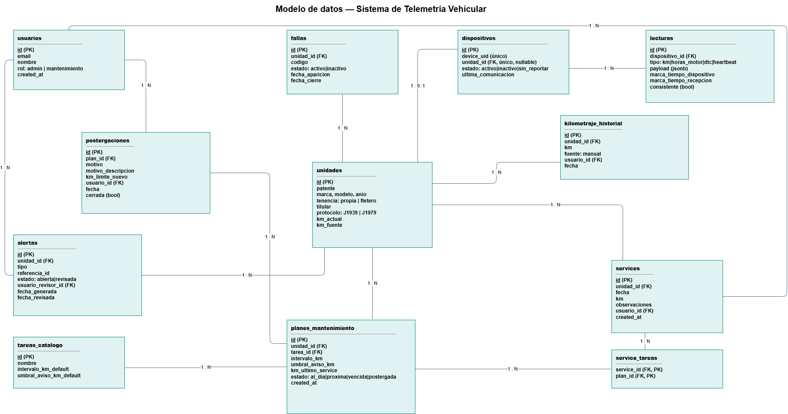

# Tecnicatura Universitaria en Programación a Distancia
### Trabajo Final Integrador
**2ª Entrega — Arquitectura y Módulos (Condición de Regular)**

# Sistema de Telemetría Vehicular para el Mantenimiento Preventivo de Flotas Mixtas

**Integrantes:** Patricio Sussini Guanziroli (hardware y firmware, frontend), Matias Ezequiel Vazquez (backend, bases de datos e infraestructura)

**Tutor:** Sebastián Bruselario

Este documento presenta el esquema de base de datos y el listado de módulos a desarrollar, en base a los requerimientos funcionales (RF), no funcionales (RNF) y reglas de negocio (RN) definidos en la [1ª Entrega — Propuesta de proyecto](01-propuesta-proyecto.md).

---

## Índice

- [Tecnicatura Universitaria en Programación a Distancia](#tecnicatura-universitaria-en-programación-a-distancia)
    - [Trabajo Final Integrador](#trabajo-final-integrador)
- [Sistema de Telemetría Vehicular para el Mantenimiento Preventivo de Flotas Mixtas](#sistema-de-telemetría-vehicular-para-el-mantenimiento-preventivo-de-flotas-mixtas)
  - [Índice](#índice)
  - [1. Motor de base de datos](#1-motor-de-base-de-datos)
  - [2. Esquema de base de datos](#2-esquema-de-base-de-datos)
    - [2.1 Diagrama entidad-relación](#21-diagrama-entidad-relación)
    - [2.2 Tablas](#22-tablas)
      - [`usuarios`](#usuarios)
      - [`unidades`](#unidades)
      - [`dispositivos`](#dispositivos)
      - [`parametros` (catálogo, opcional para reportes)](#parametros-catálogo-opcional-para-reportes)
      - [`lecturas`](#lecturas)
      - [`tareas_catalogo`](#tareas_catalogo)
      - [`planes_mantenimiento`](#planes_mantenimiento)
      - [`services`](#services)
      - [`service_tareas`](#service_tareas)
      - [`postergaciones`](#postergaciones)
      - [`fallas`](#fallas)
      - [`alertas`](#alertas)
      - [`kilometraje_historial`](#kilometraje_historial)
    - [2.3 Índices](#23-índices)
    - [2.4 Decisiones de diseño](#24-decisiones-de-diseño)
  - [3. Listado de módulos](#3-listado-de-módulos)
    - [3.1 Orden de desarrollo](#31-orden-de-desarrollo)
    - [3.2 Contrato del mensaje MQTT](#32-contrato-del-mensaje-mqtt)
  - [4. Trazabilidad entre requerimientos y diseño](#4-trazabilidad-entre-requerimientos-y-diseño)

---

## 1. Motor de base de datos

**Relacional: PostgreSQL, provisto por Supabase (plan gratuito).**

Se descarta un motor documental porque el dominio central del sistema —unidades, dispositivos, planes de mantenimiento, tareas, services y postergaciones— tiene relaciones fijas y con integridad referencial importante (por ejemplo, RN02: un dispositivo vinculado como máximo a una unidad; RN06: registrar un service cierra postergaciones abiertas de esa tarea). PostgreSQL además admite columnas `JSONB`, que se usan puntualmente para datos de forma variable (el payload crudo de cada lectura MQTT), combinando ambos modelos sin necesitar dos motores. Supabase se eligió también en la propuesta ([sección 9.4](01-propuesta-proyecto.md#94-stack-de-software)) porque incluye autenticación de usuarios integrada, lo que cubre RF01 y RF17.

## 2. Esquema de base de datos

### 2.1 Diagrama entidad-relación



### 2.2 Tablas

#### `usuarios`

| Columna | Tipo | Notas |
|---|---|---|
| `id` | uuid, PK | Gestionado por Supabase Auth. |
| `email` | text, único | RF01. |
| `nombre` | text | |
| `rol` | text | `admin` \| `mantenimiento` (RN11). |
| `created_at` | timestamptz | |

#### `unidades`

| Columna | Tipo | Notas |
|---|---|---|
| `id` | uuid, PK | |
| `patente` | text, único | RF02. |
| `marca`, `modelo`, `anio` | text, text, int | RF02. |
| `tenencia` | text | `propia` \| `fletero` (RF02, RN01). |
| `titular` | text | Dueño de la unidad si es de un fletero. |
| `protocolo` | text | `J1939` \| `J1979`, protocolo del vehículo (RN08, RNF08). |
| `km_actual` | numeric | Último kilometraje válido conocido (RF05). |
| `km_fuente` | text | `odometro` \| `estimado` \| `manual` (RF05, RN08). |
| `created_at` | timestamptz | |

#### `dispositivos`

| Columna | Tipo | Notas |
|---|---|---|
| `id` | uuid, PK | |
| `device_uid` | text, único | Identificador que envía el firmware (RF03). |
| `unidad_id` | uuid, FK → `unidades.id`, único, nullable | Único para que una unidad tenga a lo sumo un dispositivo activo y un dispositivo esté vinculado a lo sumo a una unidad (RN02). `NULL` mientras el dispositivo no está vinculado. |
| `estado` | text | `activo` \| `inactivo` \| `sin_reportar` (RF03, RN10). |
| `ultima_comunicacion` | timestamptz | Actualizada en cada mensaje MQTT válido; la usa el temporizador de CU14. |
| `created_at` | timestamptz | |

#### `parametros` (catálogo, opcional para reportes)

No se modela como tabla separada en esta versión: el tipo de lectura (`km`, `horas_motor`, `dtc`) alcanza para el cálculo de mantenimiento. El detalle del parámetro de origen (PGN/SPN en J1939, PID en J1979) se conserva sin normalizar dentro de `lecturas.payload`, para no acoplar el esquema a los parámetros de un protocolo específico (RNF08, RNF09).

#### `lecturas`

| Columna | Tipo | Notas |
|---|---|---|
| `id` | uuid, PK | |
| `dispositivo_id` | uuid, FK → `dispositivos.id` | RF04. |
| `tipo` | text | `km` \| `horas_motor` \| `dtc` \| `heartbeat`. |
| `payload` | jsonb | Datos crudos del mensaje: protocolo, y según el tipo, valor numérico o código de falla, más el identificador del parámetro de origen (PGN+SPN o PID). |
| `marca_tiempo_dispositivo` | timestamptz | Timestamp original del dispositivo (RNF02). |
| `marca_tiempo_recepcion` | timestamptz | RF04. |
| `consistente` | boolean | `false` si una lectura de `km` es menor al `km_actual` de la unidad (RN09); no actualiza el kilometraje pero queda auditada. |

#### `tareas_catalogo`

Catálogo de tipos de tarea de mantenimiento, con los intervalos por defecto relevados en el caso de estudio (RN03).

| Columna | Tipo | Notas |
|---|---|---|
| `id` | uuid, PK | |
| `nombre` | text | Ej.: "Cambio de aceite de motor", "Filtro secador de aire de frenos", "Aceite de caja y diferencial". |
| `intervalo_km_default` | int | 40.000 / 100.000 / 150.000 según la tarea. |
| `umbral_aviso_km_default` | int | 4.000 km por defecto (RN05). |

#### `planes_mantenimiento`

Instancia cada tarea del catálogo sobre una unidad concreta (RF07). Es también la tabla que concentra el estado de mantenimiento de cada tarea por unidad (RF08).

| Columna | Tipo | Notas |
|---|---|---|
| `id` | uuid, PK | |
| `unidad_id` | uuid, FK → `unidades.id` | |
| `tarea_id` | uuid, FK → `tareas_catalogo.id` | |
| `intervalo_km` | int | Copiado del catálogo al crear el plan; editable por unidad (RN03). |
| `umbral_aviso_km` | int | Ídem. |
| `km_ultimo_service` | numeric | Kilometraje desde el que se cuenta el intervalo; se reinicia al registrar un service (RN06). |
| `estado` | text | `al_dia` \| `proxima` \| `vencida` \| `postergada`, calculado según RN04, RN05, RN07. |
| `created_at` | timestamptz | |

Restricción: única combinación `(unidad_id, tarea_id)` activa por unidad.

#### `services`

| Columna | Tipo | Notas |
|---|---|---|
| `id` | uuid, PK | |
| `unidad_id` | uuid, FK → `unidades.id` | |
| `fecha` | date | RF09. |
| `km` | numeric | Kilometraje al momento del service; si supera el `km_actual` de la unidad, la actualiza (RN08). |
| `observaciones` | text | |
| `usuario_id` | uuid, FK → `usuarios.id` | Trazabilidad (RNF11). |
| `created_at` | timestamptz | |

#### `service_tareas`

Tabla de unión: un service puede cubrir varias tareas del plan de mantenimiento (RF09, RN06).

| Columna | Tipo | Notas |
|---|---|---|
| `service_id` | uuid, FK → `services.id` | |
| `plan_id` | uuid, FK → `planes_mantenimiento.id` | |

Clave primaria compuesta `(service_id, plan_id)`.

#### `postergaciones`

| Columna | Tipo | Notas |
|---|---|---|
| `id` | uuid, PK | |
| `plan_id` | uuid, FK → `planes_mantenimiento.id` | |
| `motivo` | text | `falta_espacio` \| `salida_urgente` \| `otro` (RF10, RN07). |
| `motivo_descripcion` | text | Obligatorio si `motivo = 'otro'`. |
| `km_limite_nuevo` | int | RN07. |
| `usuario_id` | uuid, FK → `usuarios.id` | RNF11. |
| `fecha` | timestamptz | |
| `cerrada` | boolean | Se marca `true` al registrar el service correspondiente (RN06). |

#### `fallas`

Códigos de falla (DTC) informados por una unidad (RF11).

| Columna | Tipo | Notas |
|---|---|---|
| `id` | uuid, PK | |
| `unidad_id` | uuid, FK → `unidades.id` | |
| `codigo` | text | Código de falla informado por el vehículo (DM1 en J1939, DTC en J1979). |
| `estado` | text | `activo` \| `inactivo` (RN12). |
| `fecha_aparicion` | timestamptz | |
| `fecha_cierre` | timestamptz | Nula mientras está activo. |

#### `alertas`

| Columna | Tipo | Notas |
|---|---|---|
| `id` | uuid, PK | |
| `unidad_id` | uuid, FK → `unidades.id` | |
| `tipo` | text | `tarea_proxima` \| `tarea_vencida` \| `falla_nueva` \| `dispositivo_sin_reportar` (RF12). |
| `referencia_id` | uuid | Apunta a `planes_mantenimiento.id`, `fallas.id` o `dispositivos.id` según `tipo`. |
| `estado` | text | `abierta` \| `revisada` (RF13). |
| `usuario_revisor_id` | uuid, FK → `usuarios.id`, nullable | |
| `fecha_generada` | timestamptz | |
| `fecha_revisada` | timestamptz, nullable | |

#### `kilometraje_historial`

Registra cada carga manual de kilometraje, para trazabilidad y para el historial por unidad (RF06, RF16, RNF11).

| Columna | Tipo | Notas |
|---|---|---|
| `id` | uuid, PK | |
| `unidad_id` | uuid, FK → `unidades.id` | |
| `km` | numeric | |
| `fuente` | text | `manual` (las fuentes automáticas quedan en `lecturas`). |
| `usuario_id` | uuid, FK → `usuarios.id` | |
| `fecha` | timestamptz | |

### 2.3 Índices

- `lecturas (dispositivo_id, marca_tiempo_recepcion)`: consultas de la última lectura por dispositivo y del histórico (RF04).
- `dispositivos (device_uid)` único: identificar el dispositivo emisor en cada mensaje MQTT.
- `dispositivos (unidad_id)` único parcial (`WHERE unidad_id IS NOT NULL`): refuerza RN02.
- `planes_mantenimiento (unidad_id, estado)`: la vista de la flota filtra y ordena por estado más crítico (RF14).
- `planes_mantenimiento (unidad_id, tarea_id)` único: evita duplicar el plan de una tarea sobre la misma unidad.
- `fallas (unidad_id, estado)`: contar fallas activas por unidad (RF14, RF15).
- `alertas (estado, fecha_generada)`: listar alertas abiertas ordenadas por antigüedad (RF13).
- `postergaciones (plan_id, cerrada)`: saber si un plan tiene una postergación abierta (RN06, RN07).

### 2.4 Decisiones de diseño

- **Modelo agnóstico de protocolo.** Ninguna tabla depende de si la unidad usa J1939 o J1979: `unidades.protocolo` registra cuál usa cada una y el detalle del parámetro de origen (PGN/SPN o PID) queda en `lecturas.payload`. Esto sostiene RNF08 (portabilidad) y RNF09 (aislar la interpretación del protocolo en el módulo de ingesta, sin que un cambio de firmware afecte al resto del sistema).
- **`planes_mantenimiento` como entidad central del estado de mantenimiento.** En vez de recalcular el estado de cada tarea en cada consulta a partir de todo el historial de services, cada plan guarda `km_ultimo_service` y `estado`, que se actualizan al procesar una lectura de kilometraje (CU06) o al registrar un service (CU09) o una postergación (CU10). Esto resuelve directamente RF08 y las reglas RN04 a RN07.
- **`service_tareas` en vez de una tarea por service.** Un mismo evento de taller normalmente cubre varias tareas a la vez (aceite de motor y filtros, por ejemplo), tal como surge de la entrevista al mecánico. Modelarlo como tabla de unión evita duplicar `services` por cada tarea realizada el mismo día.
- **`lecturas.payload` en JSONB.** El formato exacto de cada lectura varía según el protocolo y el tipo de dato; usar una columna JSONB evita crear una tabla o columna por cada combinación de protocolo y parámetro, a costa de no poder indexar el contenido interno (aceptable: las consultas de mantenimiento se resuelven contra `planes_mantenimiento`, no contra `lecturas`).
- **Kilometraje nunca disminuye (RN09).** No se modela con una restricción de base de datos (requeriría conocer el máximo histórico en cada insert); se resuelve en el módulo de ingesta, que compara contra `unidades.km_actual` antes de escribir y marca `lecturas.consistente = false` cuando corresponde.

## 3. Listado de módulos

| # | Módulo | Responsabilidad | RF / RN que cubre |
|---|---|---|---|
| M1 | Autenticación y autorización | Login con Supabase Auth; verificación de rol (`admin` \| `mantenimiento`) en cada operación. | RF01, RF17, RN11, RNF04 |
| M2 | Gestión de unidades y dispositivos | Alta, baja y modificación de unidades y dispositivos; vinculación dispositivo–unidad. | RF02, RF03, RN01, RN02 |
| M3 | Ingesta MQTT | Suscripción al broker, validación de mensajes, interpretación del payload según protocolo, persistencia en `lecturas`, actualización de `unidades.km_actual` y `dispositivos.ultima_comunicacion`. | RF04, RF05, RNF01, RNF02, RNF03, RNF07, RNF08, RNF09, RN08, RN09 |
| M4 | Motor de mantenimiento | Gestión del catálogo de tareas y de los planes por unidad; recalcula el estado de cada plan ante cada lectura de kilometraje relevante. | RF07, RF08, RN03, RN04, RN05 |
| M5 | Services y postergaciones | Registro de services (con sus tareas cubiertas) y de postergaciones; reinicia el conteo del plan y cierra postergaciones abiertas. | RF09, RF10, RF16, RN06, RN07, RNF11 |
| M6 | Gestión de fallas (DTC) | Alta y cierre de códigos de falla informados por cada unidad. | RF11, RN12 |
| M7 | Alertas | Generación de alertas desde M3, M4 y M6; consulta y marcado como revisada. | RF12, RF13 |
| M8 | Temporizador de dispositivos | Proceso periódico que detecta dispositivos sin reportar y genera/cierra la alerta correspondiente (CU14). | RF12, RN10 |
| M9 | API REST y dashboard | Endpoints para el frontend: vista de flota, detalle de unidad, historial, carga manual de kilometraje. | RF06, RF14, RF15, RF16, RNF06, RNF10 |

### 3.1 Orden de desarrollo

1. **M1 — Autenticación y autorización**, porque el resto de los módulos requiere un usuario y un rol para operar.
2. **M2 — Gestión de unidades y dispositivos**, porque sin unidades ni dispositivos no hay nada que monitorear.
3. **M3 — Ingesta MQTT**, con el simulador de flota ([sección 9.2 de la propuesta](01-propuesta-proyecto.md#92-estrategia-de-validación)) como fuente de datos mientras no hay hardware conectado en forma continua.
4. **M4 — Motor de mantenimiento**, que consume las lecturas de M3 y necesita M2 para saber a qué unidades aplicar los planes.
5. **M6 — Gestión de fallas**, en paralelo con M4: ambos se disparan desde M3.
6. **M5 — Services y postergaciones**, que depende de que M4 exista para tener planes sobre los cuales operar.
7. **M7 — Alertas**, una vez que M3, M4 y M6 generan los eventos que las disparan.
8. **M8 — Temporizador de dispositivos**, independiente del resto salvo por M2 (necesita la lista de dispositivos activos) y M7 (para generar la alerta).
9. **M9 — API REST y dashboard**, en paralelo con el frontend, a medida que cada módulo anterior expone datos consultables.

### 3.2 Contrato del mensaje MQTT

Mensaje publicado por el dispositivo, protocolo-agnóstico (a diferencia de un contrato atado a códigos PID de J1979):

```json
{
  "device_uid": "esp32-0F3A21",
  "protocolo": "J1939",
  "timestamp": "2026-09-20T14:32:10Z",
  "lecturas": [
    { "tipo": "km", "valor": 812430, "origen": { "pgn": 65248 } },
    { "tipo": "horas_motor", "valor": 15320, "origen": { "pgn": 65253 } },
    { "tipo": "dtc", "codigo": "SPN-100-FMI-3", "activo": true, "origen": { "pgn": "DM1" } }
  ]
}
```

Para una unidad con protocolo `J1979`, el campo `origen` usa `{ "pid": "010C" }` en vez de `pgn`/`spn`, y el kilometraje se envía como `tipo: "km"` estimado por integración de velocidad, según lo definido en RN08. El módulo de ingesta (M3) es el único que interpreta `origen`; el resto del sistema solo usa `tipo` y `valor`.

## 4. Trazabilidad entre requerimientos y diseño

| Requerimiento / regla | Tabla(s) | Módulo(s) |
|---|---|---|
| RF01, RF17, RN11 | `usuarios` | M1 |
| RF02, RN01 | `unidades` | M2 |
| RF03, RN02 | `dispositivos` | M2 |
| RF04, RF05, RNF01–03, RNF07–09, RN08, RN09 | `lecturas`, `unidades.km_actual` | M3 |
| RF06 | `kilometraje_historial` | M9 |
| RF07, RN03 | `tareas_catalogo`, `planes_mantenimiento` | M4 |
| RF08, RN04, RN05 | `planes_mantenimiento.estado` | M4 |
| RF09, RN06, RNF11 | `services`, `service_tareas` | M5 |
| RF10, RN07 | `postergaciones` | M5 |
| RF11, RN12 | `fallas` | M6 |
| RF12, RF13 | `alertas` | M7 |
| RN10 | `dispositivos.ultima_comunicacion`, `alertas` | M8 |
| RF14, RF15, RF16 | vistas sobre `unidades`, `planes_mantenimiento`, `fallas`, `services`, `postergaciones` | M9 |
